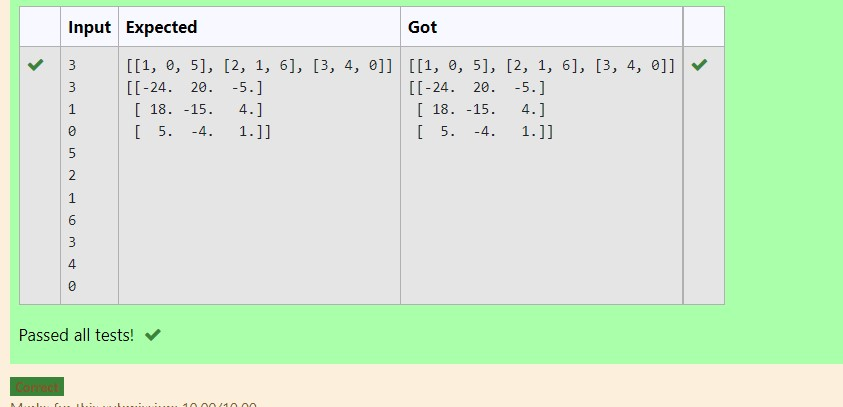

# Inverse-of-matrix

### AIM:
Write a python program to find the inverse of a nested array.

### ALGORITHM:
### Step 1:
Import numpy library using import statement.

### Step 2:
Create an empty list and prompt the user to provide number of rows and colums for the nested array using int() method.

### Step 3:
Initiate a nested for loop and an empty temprary list to get and append elements from the user and store it in a nested array form.

### Step 4:
Display the original nested array.

### Step 5:
Find the inverse of the array using linalg.inv() method and display the result.

### PROGRAM:
```
'''
Program to find the inverse of a nested array
Developed by: vidya neela
RegisterNumber: 21500298
'''

import numpy as np
rows=int(input())
columns=int(input())
l1=[]
for i in range(rows):
    temp=[]
    for j in range(columns):
        t=int(input())
        temp+=[t]
    l1+=[temp]
print(l1)
print(np.linalg.inv(l1))
```

## OUTPUT:



## RESULT:
Thus the python program to find the inverse of a nested array is successfully executed.